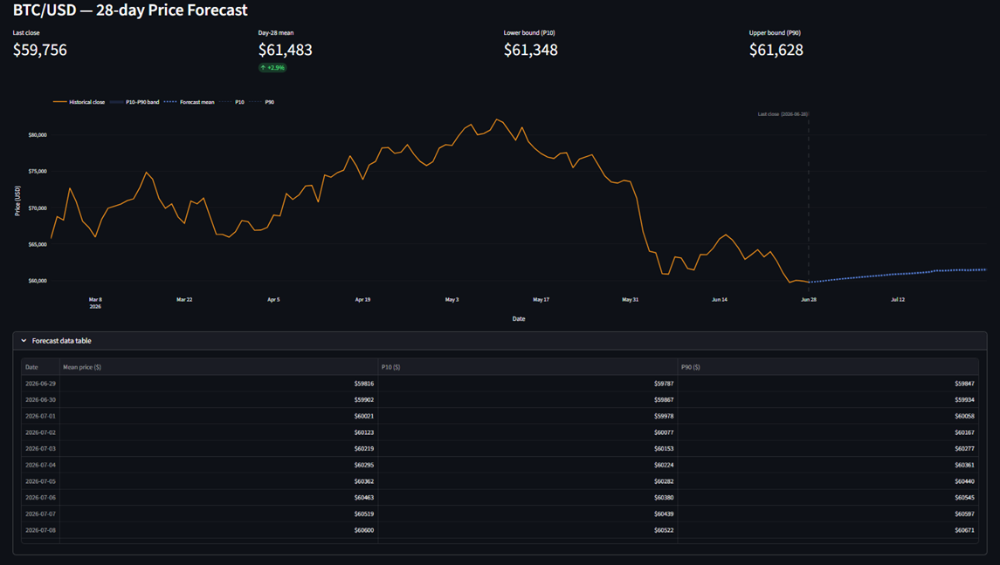

# BTC Price Predictor

A Bitcoin price forecasting pipeline built on a stacked LSTM in PyTorch. The model predicts daily log returns over horizons of 7, 14, 21, or 28 days and estimates prediction uncertainty via Monte Carlo Dropout. Results are visualized in an interactive Streamlit app with a price history chart and a shaded confidence band.



**Live demo:** [https://bt-7dff3b7ba8f246528d893ace7e964833.ecs.us-east-2.on.aws](https://bt-7dff3b7ba8f246528d893ace7e964833.ecs.us-east-2.on.aws)

---

## Features

- **Multi-horizon direct forecasting** — single forward pass produces all 28 output steps simultaneously, with a slider to trim to 7/14/21/28 days
- **Uncertainty quantification via Monte Carlo Dropout** — 100 stochastic forward passes at inference time yield a P10–P90 confidence band expressed in price space
- **Interchangeable data source** — pulls from Yahoo Finance by default; falls back gracefully to the same interface if Snowflake credentials are present
- **Local CSV cache** — avoids redundant API calls; refreshable on demand
- **Streamlit + Plotly dashboard** — unified hover tooltip, shaded uncertainty band, and a collapsible data table; handles missing model artifacts with an actionable error message

---

## Design Decisions

**Log returns instead of raw prices.**
BTC prices are non-stationary: the series has a trend and its variance grows over time. Training an LSTM directly on prices forces the model to memorize scale rather than pattern. Log returns (`log(P_t / P_{t-1})`) remove the trend, are approximately stationary, and have a distribution that is roughly consistent across the training window. After inference, returns are reconverted to prices via `last_close × exp(cumsum(returns))`.

**Direct multi-output instead of recursive forecasting.**
A recursive approach feeds each predicted step back as input for the next. Errors compound at every step, so a 28-step recursive forecast accumulates up to 28 rounds of model error. The direct approach predicts all 28 steps in a single pass from the same input window, which bounds error to one forward pass at the cost of a larger output head. For a 28-day horizon this trade-off clearly favors direct.

**Monte Carlo Dropout for uncertainty estimation.**
Training a full ensemble of models is expensive. MC Dropout approximates Bayesian inference at nearly zero additional cost: dropout is kept active at inference time, and 100 forward passes produce 100 different predictions from the same input. The spread across these samples reflects the model's epistemic uncertainty. The implementation uses an explicit `nn.Dropout` layer on the final hidden state (separate from the inter-layer LSTM dropout) so it can be toggled independently via `enable_mc_dropout()`.

**Percentiles computed on price trajectories, not on returns.**
Each of the 100 MC samples is independently reconverted from scaled log returns to absolute prices before any aggregation. Only then are P10 and P90 computed across trajectories for each future day. Computing percentiles on raw returns and reconverting afterwards would implicitly assume the percentile of the sum equals the sum of the percentiles — which is only true for linear operations, not for the `exp(cumsum(...))` transformation involved here.

**Interchangeable data source.**
The public interface is a single function `get_clean_data(source="csv" | "snowflake")` that always returns the same DataFrame schema regardless of origin. The Snowflake branch reads credentials exclusively from environment variables (never hardcoded) and falls back to the yfinance/CSV branch with a warning if any credential is missing. This keeps the rest of the pipeline source-agnostic and allows production deployment to swap in a managed data warehouse without touching model or app code.

**StandardScaler fitted on training data only.**
The scaler is fitted on the training slice and then applied with `.transform()` to the validation slice and to inference inputs. Fitting on the full series before splitting would leak distributional information from the future into the training process. The fitted scaler is persisted alongside model weights and loaded at inference time so predictions are in the same scale space as training targets before inverse transformation.

---

## Limitations

BTC daily returns are close to a random walk. In practice this means that any model trained on past returns has limited predictive signal, and a well-calibrated baseline is often just the last known price. The LSTM here will tend to produce smooth, mean-reverting predictions that underestimate realized volatility — the uncertainty band widens the further out you forecast, but it will not reproduce the sharp intraday moves that characterize crypto markets.

This project is an end-to-end ML engineering exercise covering data ingestion, sequence modeling, uncertainty quantification, and interactive deployment. It is not a trading tool, not investment advice, and should not be used as a basis for financial decisions of any kind.

---

## Stack

| Layer | Library |
|---|---|
| Model | PyTorch 2.x |
| Data | yfinance, pandas, NumPy |
| Preprocessing | scikit-learn (`StandardScaler`) |
| Optional data source | snowflake-connector-python |
| Dashboard | Streamlit, Plotly |
| Artifact persistence | joblib |

---

## Deployment

The app runs on AWS ECS Fargate (containerized with Docker, image stored in ECR, served via an Application Load Balancer with HTTPS). No servers to manage — the task scales to zero when idle and is fully reproducible from the `Dockerfile` in the repo.

---

## Getting Started

```bash
git clone https://github.com/TURRIvalentin/BTC-Price-Predictor.git
cd BTC-Price-Predictor
pip install -r requirements.txt
```

**Train the model** (downloads ~4 years of BTC-USD data on first run, cached to `data/`):

```bash
python train.py
```

Optional flags:
```bash
python train.py --hidden-size 256 --num-layers 3 --patience 30 --max-epochs 300
```

**Launch the app:**

```bash
streamlit run app.py
```

**Snowflake (optional).** If no `.env` file is present, the pipeline falls back to yfinance automatically. To use Snowflake, create a `.env` file (excluded from version control) with:

```
SNOWFLAKE_ACCOUNT=...
SNOWFLAKE_USER=...
SNOWFLAKE_PASSWORD=...
SNOWFLAKE_WAREHOUSE=...
SNOWFLAKE_DATABASE=...
SNOWFLAKE_SCHEMA=...
SNOWFLAKE_TABLE=BTC_OHLCV      # optional, this is the default
```

Then pass `--source snowflake` to `train.py` or select it in `get_clean_data()`.

---

## Project Structure

```
├── data.py          # OHLCV download (yfinance / Snowflake), CSV cache, log-return computation
├── model.py         # BTCDataset (sliding window), BTCPredictor (stacked LSTM), build_dataloaders()
├── train.py         # Training loop: early stopping, grad clipping, checkpoint saving
├── predict.py       # MC Dropout inference: 100 forward passes → P10/mean/P90 in price space
├── app.py           # Streamlit dashboard: horizon selector, historical + forecast chart
├── requirements.txt
├── .gitignore       # Excludes data/, models/, .env, __pycache__, venvs
└── docs/
    └── screenshot.png   # (add manually)
```

`data/` and `models/` are created at runtime and excluded from version control. `models/` contains `btc_predictor.pt`, `scaler.pkl`, and `hparams.json` — the three artifacts needed for inference.
